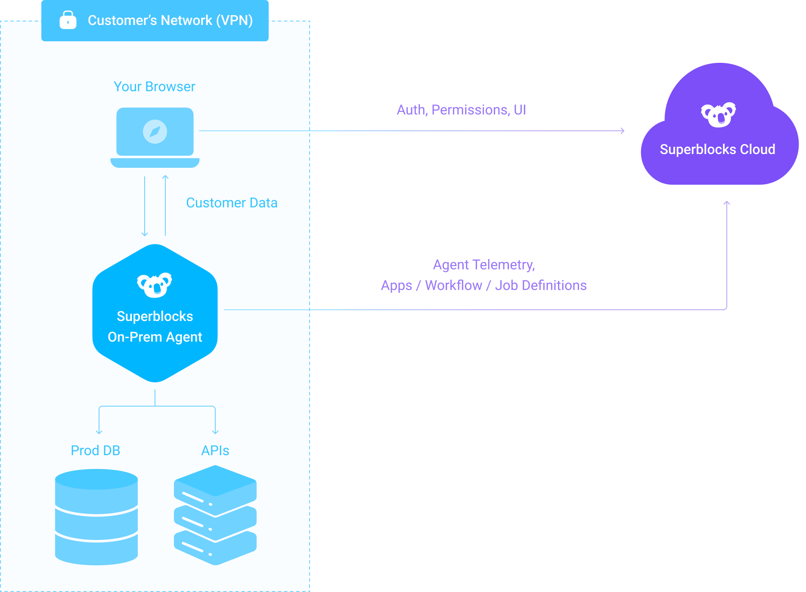

<p align="center">
  
</p>

<h1 align="center">On Premise Agent (OPA)</h1>
<p align="center">Keep customer data in your VPC for internal tools, while keeping Superblocks up-to-date from our cloud.</p>

<p align="center">
  
  
  
</p>

<br/>

<p align="center">
  
</p>

<br/>


This document contains configuration and deployment details for running the Superblocks agent independently.

**DISCLAIMER**: Parts of this document currently refer to an `agent` service that has been deprecated in favor of the Superblocks Agent Platform. We have introduced an `agent-controller` service and an `agent-worker` service. For now, you can find updated information in linked repositories of the [Source-Available Repositories](#source-available-repositories) section. We are currently in the process of updating the other sections of this document.

## Deployment

### kubernetes (Recommended)

The Superblocks agent can be deployed on any Kubernetes cluster.

Our charts are currently hosted under `https://charts.superblocks.com/superblocks`. Use the following commands to deploy the agent platform using the public helm chart. The latest version of the helm chart can be found [here](./helm).

```shell
helm repo add superblocks https://charts.superblocks.com/superblocks

# This will fetch the latest charts info from the Superblocks charts repo
helm repo update

helm upgrade -i -n superblocks superblocks-agent superblocks/superblocks-agent \
  --create-namespace \
  --set superblocks.agentKey='<agent-key>' # obtained during agent onboarding \
  --set superblocks.agentHostUrl='http[s]://<agent-host[:port]>/agent' \
  --set superblocks.agentEnvironment='<"*"|"staging"|"production">' \
  --set superblocks.agentDataDomain='<"app.superblocks.com"|"eu.superblocks.com">'
```

### docker

The Superblocks agent can also be deployed using the docker CLI.

To do so, first export the agent configuration.

```sh
# obtained during agent onboarding
export SUPERBLOCKS_AGENT_KEY='<agent-key>'
export SUPERBLOCKS_AGENT_HOST_URL='http[s]://<agent-host[:port]>/agent'
export SUPERBLOCKS_AGENT_ENVIRONMENT='<"*"|"staging"|"production">'
export SUPERBLOCKS_AGENT_DATA_DOMAIN='<"app.superblocks.com"|"eu.superblocks.com">'
```

Then, use our docker compose file to start the agent platform. The referenced docker compose file can be found [here](./docker/compose.yaml).

```sh
curl -s https://raw.githubusercontent.com/superblocksteam/agent/main/docker/compose.yaml | docker compose -p superblocks -f - up
```

## Requests

The Superblocks Agent Platform is designed with security as a primary consideration. Any data accessed and processed by the agent is only available to the user's browser or client, and never sent to Superblocks Cloud. Additionally, the agent only supports incoming requests from a browser/client, and not even Superblocks Cloud can call into the agent to have it perform any operations.

A detailed list of all network requests that can be made to the agent and that the agent makes can be [found here](./docs/requests.md).

## Configuration

The agent application can be configured via the use of several environment variables, and they are [documented here](./docs/configuration.md).

## Source-Available Repositories

The agent platform source code is available and can be built from source!
The following is a comprehensive list of repositories required to build the agent from source:

### Services

- [superblocksteam/agent-controller](https://github.com/superblocksteam/agent-controller) - [Docs](https://docs.superblocks.com/on-premise-agent/overview)
- [superblocksteam/agent-worker](https://github.com/superblocksteam/agent-worker) - [Docs](https://docs.superblocks.com/on-premise-agent/overview)

### Integrations

- [superblocksteam/bigquery](https://github.com/superblocksteam/bigquery) - [Docs](https://docs.superblocks.com/integrations/connect-integrations/bigquery)
- [superblocksteam/dynamodb](https://github.com/superblocksteam/dynamodb) - [Docs](https://docs.superblocks.com/integrations/connect-integrations/dynamodb)
- [superblocksteam/email](https://github.com/superblocksteam/email)
- [superblocksteam/graphql](https://github.com/superblocksteam/graphql) - [Docs](https://docs.superblocks.com/integrations/connect-integrations/graphql-apis)
- [superblocksteam/gsheets](https://github.com/superblocksteam/gsheets) - [Docs](https://docs.superblocks.com/integrations/connect-integrations/google-sheets)
- [superblocksteam/javascript](https://github.com/superblocksteam/javascript) - [Docs](https://docs.superblocks.com/build-applications/build-apis-with-data/write-javascript-business-logic)
- [superblocksteam/mariadb](https://github.com/superblocksteam/mariadb) - [Docs](https://docs.superblocks.com/integrations/connect-integrations/mariadb)
- [superblocksteam/mongodb](https://github.com/superblocksteam/mongodb) - [Docs](https://docs.superblocks.com/integrations/connect-integrations/mongodb)
- [superblocksteam/mssql](https://github.com/superblocksteam/mssql) - [Docs](https://docs.superblocks.com/integrations/connect-integrations/mssql)
- [superblocksteam/mysql](https://github.com/superblocksteam/mysql) - [Docs](https://docs.superblocks.com/integrations/connect-integrations/mysql)
- [superblocksteam/postgres](https://github.com/superblocksteam/postgres) - [Docs](https://docs.superblocks.com/integrations/connect-integrations/postgres)
- [superblocksteam/python](https://github.com/superblocksteam/python) - [Docs](https://docs.superblocks.com/build-applications/build-apis-with-data/write-python-business-logic)
- [superblocksteam/redshift](https://github.com/superblocksteam/redshift) - [Docs](https://docs.superblocks.com/integrations/connect-integrations/redshift)
- [superblocksteam/restapi](https://github.com/superblocksteam/restapi) - [Docs](https://docs.superblocks.com/integrations/connect-integrations/rest-apis)
- [superblocksteam/restapiintegration](https://github.com/superblocksteam/restapiintegration) - [Docs](https://docs.superblocks.com/integrations/connect-integrations/rest-apis)
- [superblocksteam/rockset](https://github.com/superblocksteam/rockset) - [Docs](https://docs.superblocks.com/integrations/connect-integrations/rockset)
- [superblocksteam/s3](https://github.com/superblocksteam/s3) - [Docs](https://docs.superblocks.com/integrations/connect-integrations/s3)
- [superblocksteam/snowflake](https://github.com/superblocksteam/snowflake) - [Docs](https://docs.superblocks.com/integrations/connect-integrations/snowflake)
- [superblocksteam/workflow](https://github.com/superblocksteam/workflow) - [Docs](https://docs.superblocks.com/build-workflows/what-is-a-workflow#1c-workflow-steps)

### Libraries

- [superblocksteam/shared](https://github.com/superblocksteam/shared)
- [superblocksteam/shared-backend](https://github.com/superblocksteam/shared-backend)
